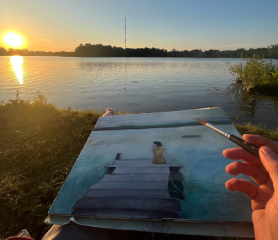

	
Hey everyone, I hope you are doing well.

As the summer weather is in full force in the blazing sun of Ohio, the winter blues have melted away, and that emotion is clearly showing in my painting's colors and mood.

An update on my store front: I was not happy with the quality of the Print Posters I was offering through a Print on Order supplier. It was a mix of print quality and mainly to do with shipping methods of being rolled, causing some creasing. Any framed prints were perfectly fine, but I have gone ahead and disabled all non-framed poster prints on my online store. I have already been working with higher quality printer to supply art prints that meet my standard. I may also very well move to mainly offering Limited Edition prints, which will also allow me the opportunity to sign all prints on-going and ensure proper shipping quality are maintained. You will already start to see some of these prints offered in my online store.

As for my actual art... I've done a few more paintings that are ready for purchase. So check out my latest work, click any image for my details, below:









## Upcoming Exhibits ##

I have entered in to a few more exhibits recently. The first being the **[Stark County Artists Exhibit](https://www.massillonmuseum.org/assets/MassMu_Stark-County-Artists-2024-info.pdf?sender_campaign=elg2G5&sender_ctype=email&sender_customer=WL3546J&utm_campaign=More+Paintings+Completed%21+🎨+-+July%2C+2024+Artist+Newsletter&utm_medium=email&utm_source=newsletter)**.





Another being the **[Winged Wonders: An Art Competition of Bird-Inspired Art Exhibit](https://artrepreneur.com/opencall/birds-and-feathers-art-competition-2024?sender_campaign=elg2G5&sender_ctype=email&sender_customer=WL3546J&utm_campaign=More+Paintings+Completed%21+🎨+-+July%2C+2024+Artist+Newsletter&utm_medium=email&utm_source=newsletter)**.




One more is the **[Flora and Fauna: An Art Competition of Earth's Blossoming Ecosystems Exhibit](https://artrepreneur.com/opencall/flora-and-fauna-art-competition-2024?sender_campaign=elg2G5&sender_ctype=email&sender_customer=WL3546J&utm_campaign=More+Paintings+Completed%21+🎨+-+July%2C+2024+Artist+Newsletter&utm_medium=email&utm_source=newsletter)**.





The last being the **[Cool Factor: An Art Competition Inspired by Cold Art Exhibit](https://artrepreneur.com/opencall/cool-art-commercial-projects-open-call-june-2024?sender_campaign=elg2G5&sender_ctype=email&sender_customer=WL3546J&utm_campaign=More+Paintings+Completed%21+🎨+-+July%2C+2024+Artist+Newsletter&utm_medium=email&utm_source=newsletter)**.




	
I will update in my next newsletters if any of my artwork is accepted in to any of these exhibits.

Don't forget about the **[Paul Brown Town Exhibit](https://paulbrownmuseum.org)** at the [Massillon Museum](https://www.massillonmuseum.org). You can view them there, starting in August through January.




